# TRAIN AI 2018 - Building the Software 2.0 Stack

## 1. Engineering: approach by decomposition

1. Identify a problem
2. Break down a big problem to smaller problems
3. Design algorithms for each individual problem
4. Compose solutions into a system (get a “stack”)

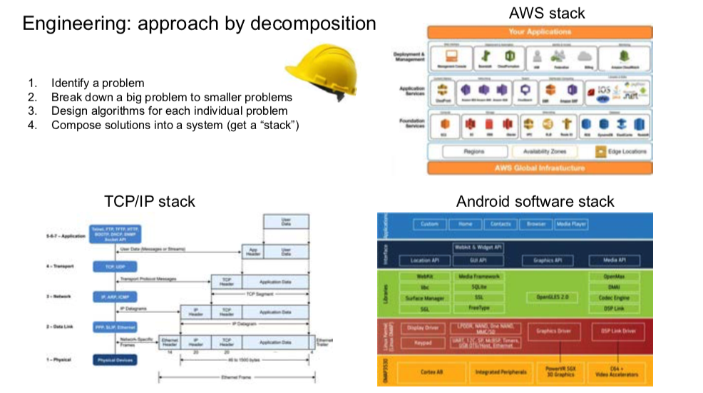

## 2. We got surprisingly far...
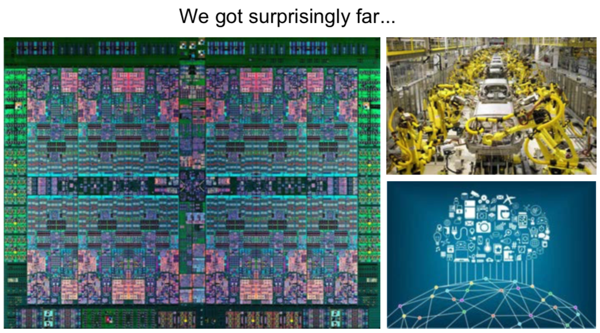

## 3. Image recognition stack
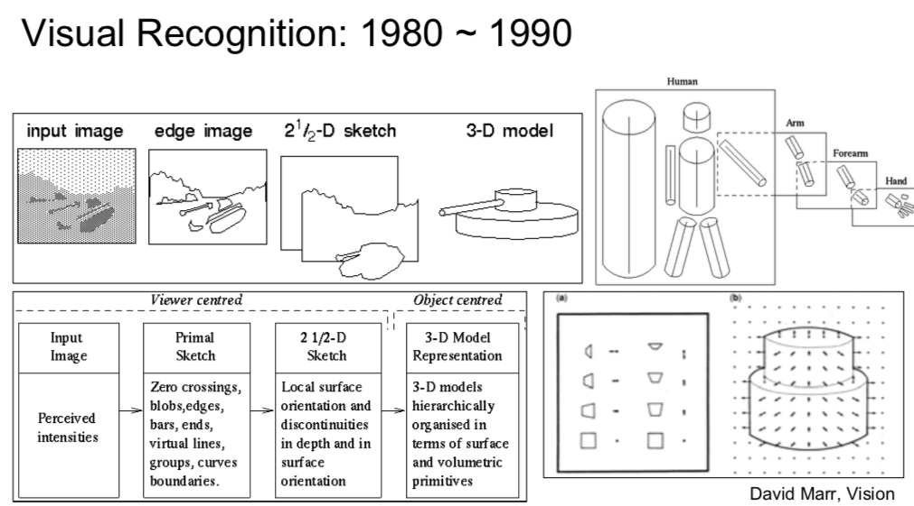

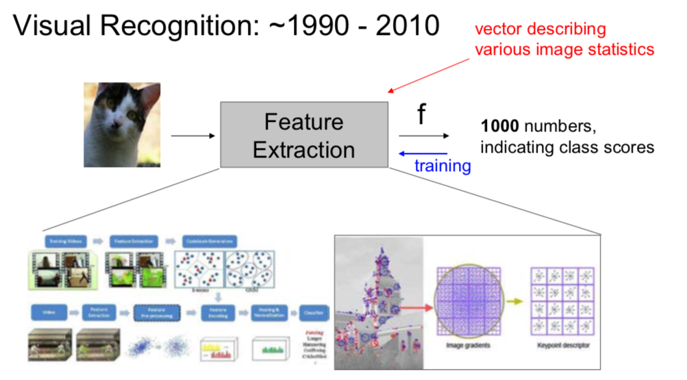

## 4. Network design without feature extraction    
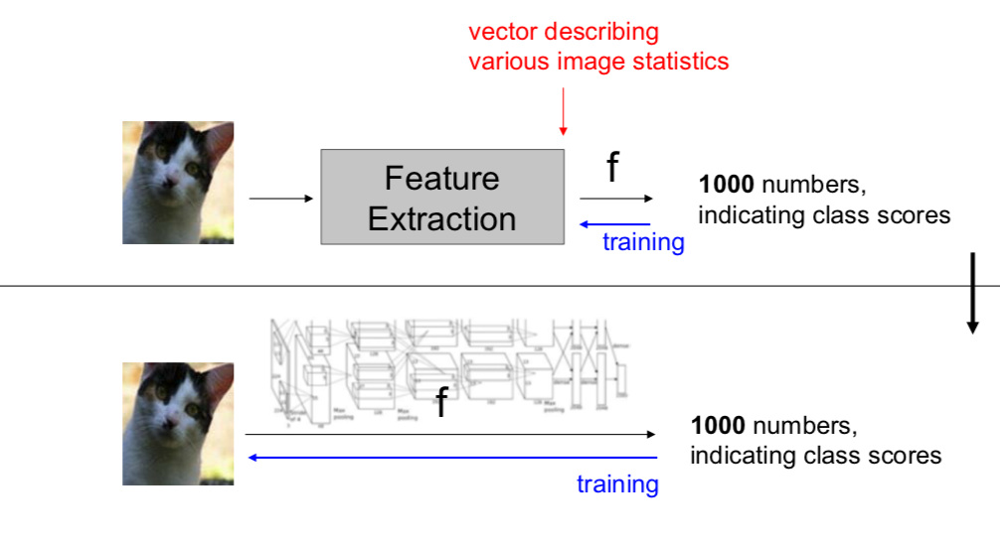

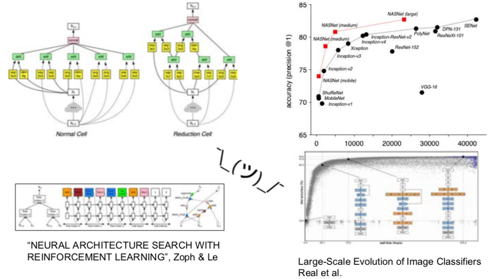

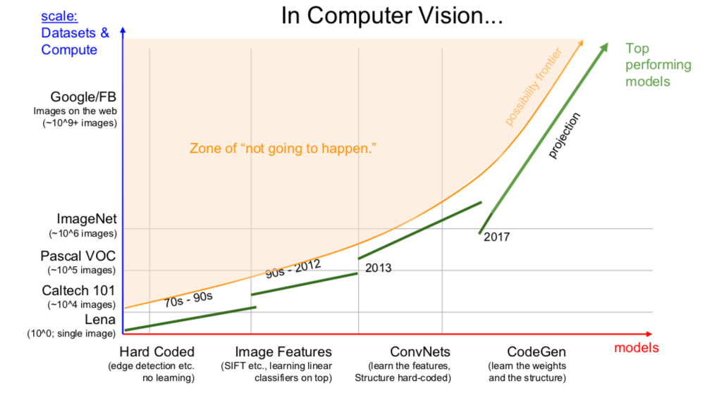

## 5. Software 1.0 vs. Software 2.0
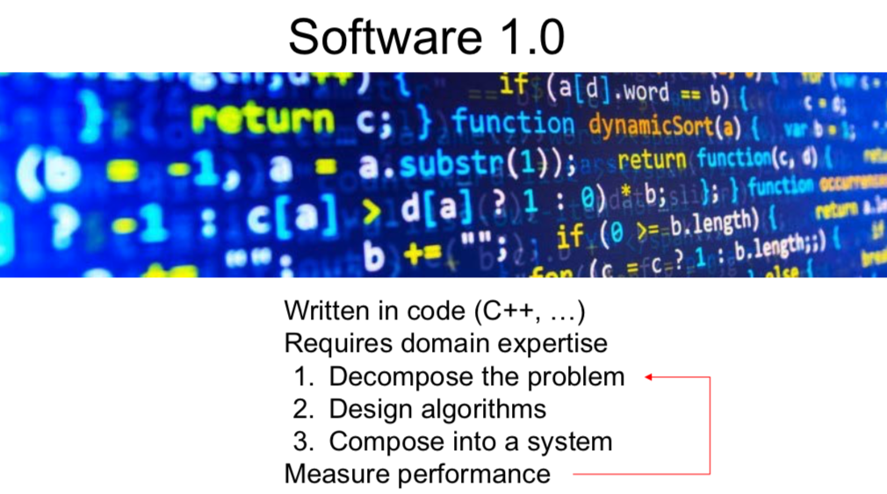

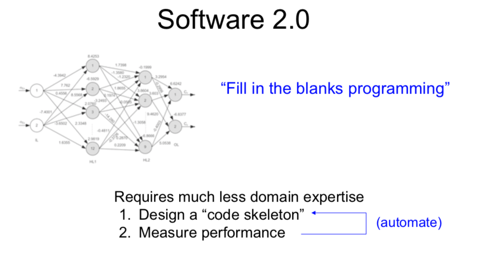

## 6. "Gradient decent can write code better than you. I'm sorry"
### New type of software written by optimization, not human
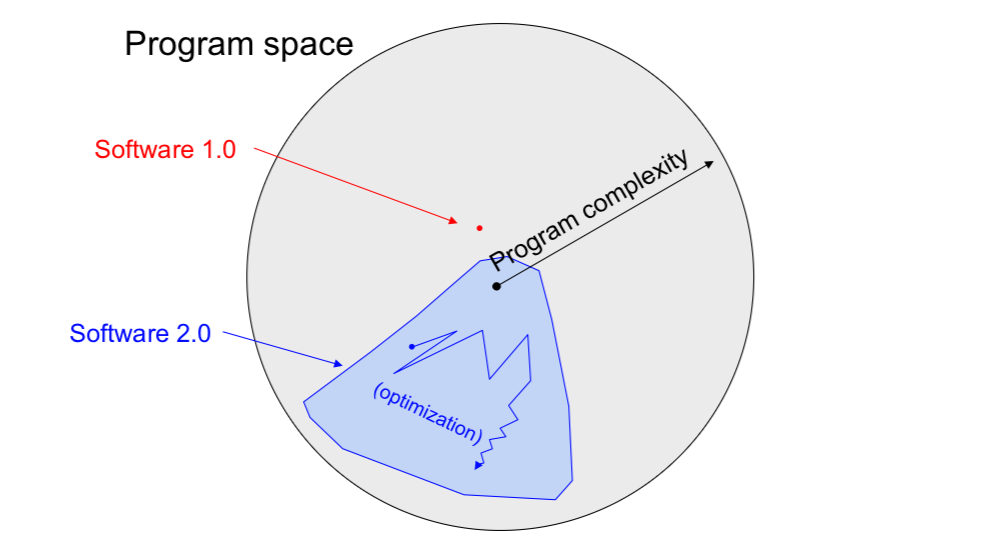

## 7. It is expansion, not replacement.
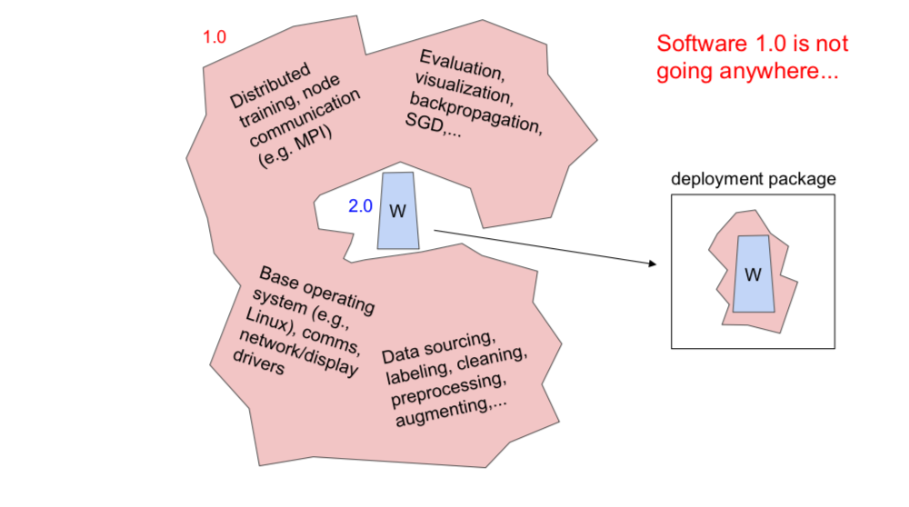

## 8. Agile and Finetuning in software 2.0
### (finetuning is new coding approach)
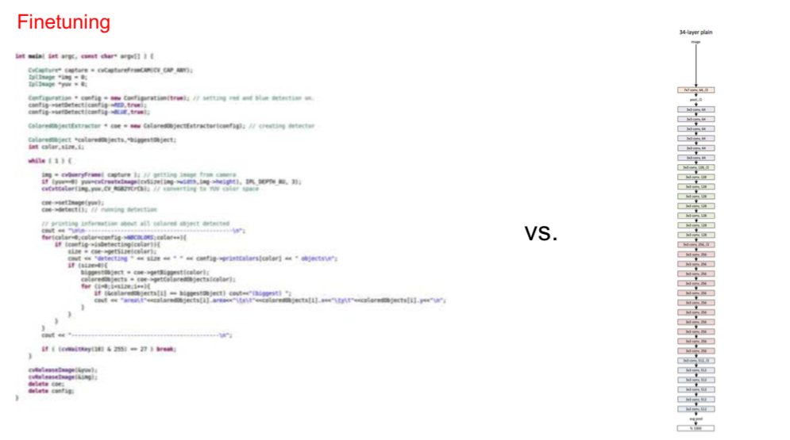

## 9. Car
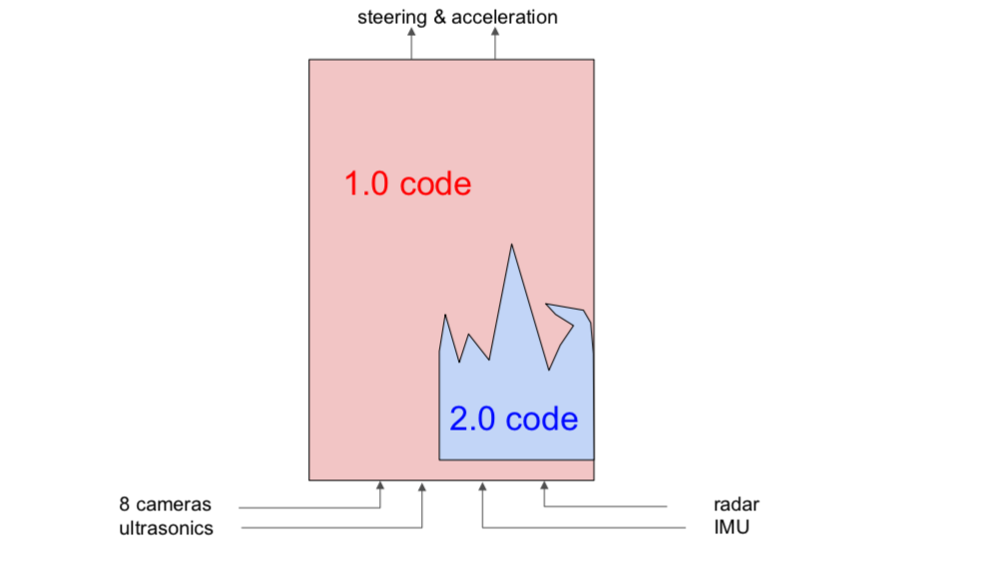
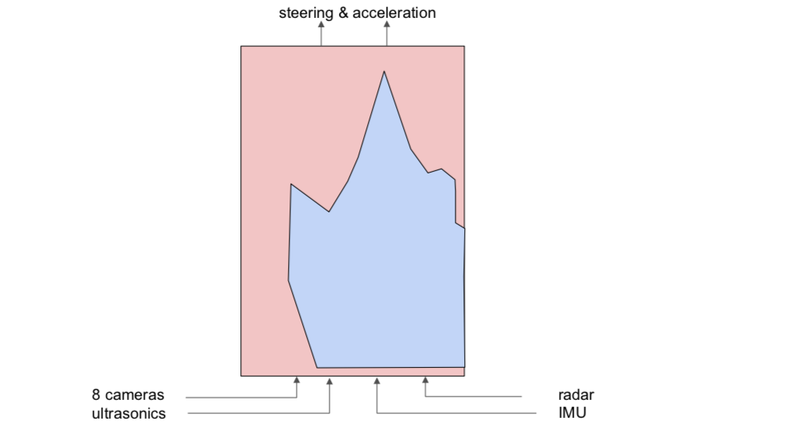

## 10. Human work
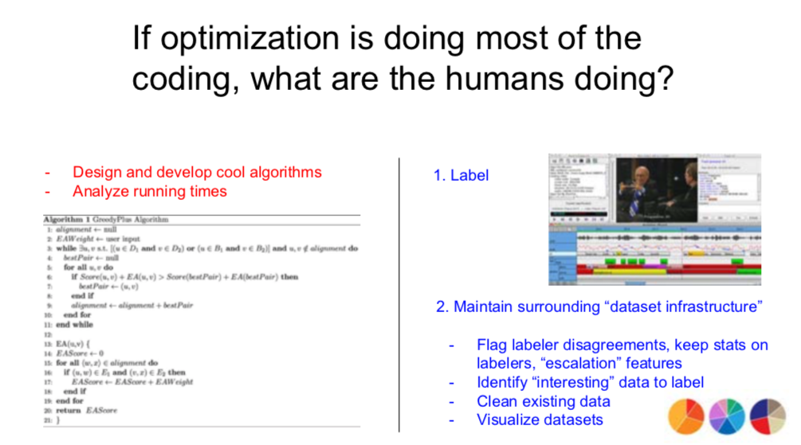

## 11. Data between academia and industry
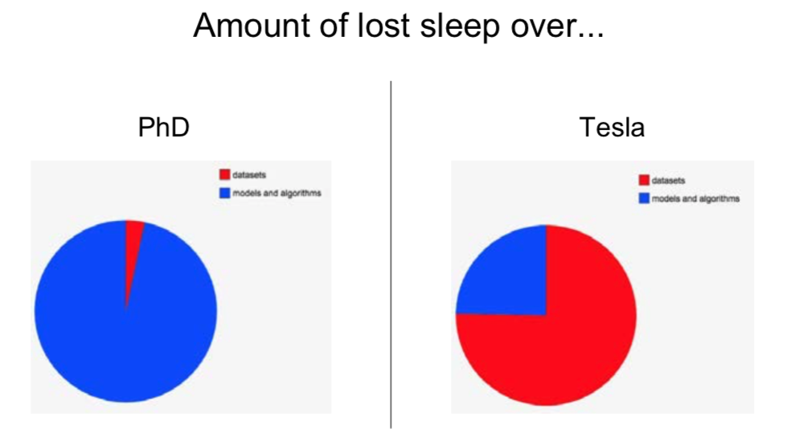

## 12. Lesson learned the hard way
- Data labeling is highly non-trivial
- Chasing Label/Data Imbalances is non-trivial
- Labeling is an iterative process
### The toolchain for the 2.0 stack does not yet exist.
(and few people realize it’s a thing)

## 13. 2.0 IDE
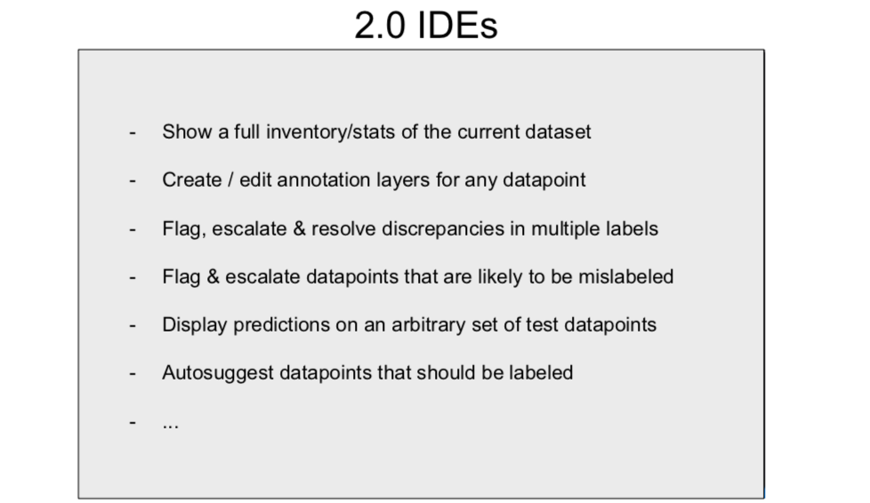

=============================================

source : https://vimeo.com/272696002

 
